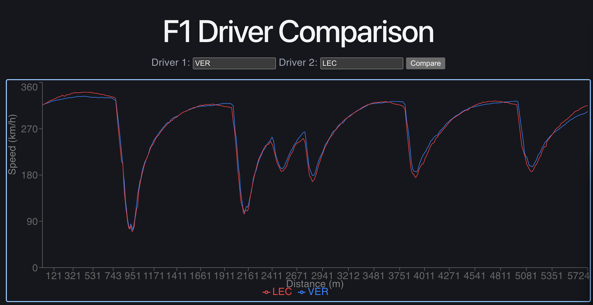

# F1 Driver Performance Dashboard

A full-stack analytics platform for comparing Formula 1 driver performance using real telemetry data. Pick any two drivers from any race since 2018, and the dashboard aligns their speed traces onto a shared distance axis so you can see exactly who was faster where — corner by corner.



## What it does

F1 teams spend millions building tools like this internally. This is the same idea, free and in the browser: pull real race telemetry, line up two drivers' data points so they're directly comparable, and chart the result.

The example above compares Max Verstappen and Charles Leclerc's fastest laps at the 2024 Italian Grand Prix — you can see both drivers trade speed advantages through Monza's chicanes.

## Tech stack

| Layer | Tool | Role |
|---|---|---|
| Data ingestion | [FastF1](https://github.com/theOehrly/Fast-F1) | Pulls real session telemetry (speed, throttle, brake) from F1's timing data |
| Data processing | Pandas / NumPy | Aggregates lap data and interpolates telemetry onto a common distance axis |
| API | FastAPI | Serves comparison data via a `/compare` endpoint with query parameters |
| Caching | Redis | Caches processed race sessions — repeat queries return in milliseconds instead of reprocessing |
| Database | PostgreSQL | Logs a permanent record of every comparison that's been run |
| Frontend | React + Recharts | Interactive line chart with synchronized axes |

## The hardest problem: aligning mismatched telemetry

Each driver's car reports speed at different moments in time, so two drivers' telemetry never lines up on the same distance values out of the box — one might have a sample at 51.2m, the other at 49.8m. Comparing them directly is meaningless until they're on the same axis.

The fix: build a clean, evenly-spaced distance grid (every 1 meter), then use linear interpolation (`np.interp`) to estimate each driver's speed at every point on that grid. Only after this step can the two drivers' data be subtracted, charted, or compared at all.

## Why caching matters here

Processing a full race session with FastF1 takes several seconds — there's a lot of raw timing data to parse. But F1 data is immutable once a race weekend ends; it never changes. That means a cached result is valid forever, so there's no cache invalidation logic needed at all. First request: slow. Every request after: near-instant, served straight from Redis.

## Running it locally

**Backend**
```bash
cd backend
python3 -m venv venv
source venv/bin/activate
pip install -r requirements.txt
fastapi dev main.py
```

**Frontend** (in a separate terminal)
```bash
cd frontend
npm install
npm run dev
```

You'll also need Redis and PostgreSQL running locally:
```bash
brew install redis
brew services start redis

createdb f1_dashboard
```

Then open `http://localhost:5173`, enter two driver codes (e.g. `VER`, `LEC`), and click Compare.
